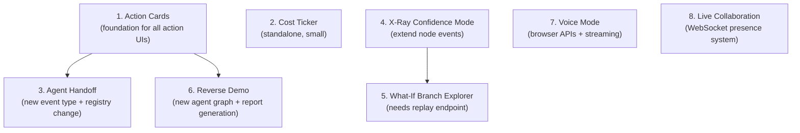
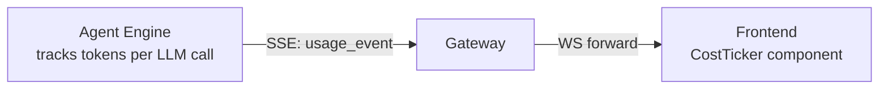
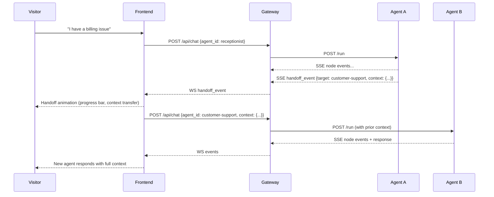

# Advanced Agent Features Plan

## Feature Dependency Order

Some features build on others. This is the recommended implementation order:




---

## Feature 1: Action Cards

Inline rich cards in the chat showing proof of real-world actions (meeting booked, WhatsApp sent, email delivered, lead saved).

### Event Protocol Extension

Add a new event type `action_event` to the existing protocol. The Python agent engine emits it from tool nodes after a tool executes. It flows through the same SSE -> Gateway -> WebSocket -> Frontend pipeline.

```
{"type": "action_event", "action": "meeting_booked", "data": {"date": "...", "time": "...", "link": "..."}}
{"type": "action_event", "action": "whatsapp_sent", "data": {"to": "+1 ***-4567", "status": "delivered"}}
```

### Changes Required

**Types** — [frontend/src/types/index.ts](frontend/src/types/index.ts)

- Add `ActionEvent` interface: `{ action: string, data: Record<string, string> }`
- Extend `WorkflowEvent.type` union with `"action_event"`

**Agent Engine** — [agent-engine/app/agents/base.py](agent-engine/app/agents/base.py)

- Add `action_results: list[dict]` to `AgentState`

**Agent Engine** — [agent-engine/app/graphs/receptionist_graph.py](agent-engine/app/graphs/receptionist_graph.py)

- After `calendar_lookup` executes, emit `action_event` with slot details
- After `crm_lookup` executes, emit `action_event` with contact found

**Frontend** — new `components/chat/action-card.tsx`

- Component that renders a styled card per action type (meeting, WhatsApp, SMS, email, lead, contact)
- Each card type has its own icon, color accent, and layout
- Demo mode shows a subtle "Demo" badge
- Mask sensitive data (phone, email) before display

**Frontend** — [components/chat/chat-interface.tsx](frontend/src/components/chat/chat-interface.tsx)

- `useWorkflowEvents` hook already receives all events; filter for `action_event` type
- Store action events in state, render `ActionCard` components inline after the relevant assistant message

**Supported card types:**

- `meeting_booked` — date, time, duration, meeting link
- `whatsapp_sent` — masked recipient, delivery status
- `sms_sent` — masked recipient, delivery status
- `email_sent` — masked recipient, subject
- `lead_saved` — confirmation message
- `contact_found` — name, department, role

---

## Feature 2: Cost Ticker

Floating counter showing real-time cost and token usage for the current conversation.

### Data Flow




### Changes Required

**Event Protocol** — new event type:

```
{"type": "usage_event", "tokens_in": 120, "tokens_out": 85, "model": "gpt-4o-mini", "cost_usd": 0.00003}
```

**Agent Engine** — [agent-engine/app/graphs/receptionist_graph.py](agent-engine/app/graphs/receptionist_graph.py)

- After each LLM call, read `response.usage_metadata` (LangChain exposes this)
- Emit `usage_event` via the same callback
- Cost calculation: hardcoded price table per model (`gpt-4o-mini`: $0.15/1M input, $0.60/1M output)

**Frontend** — new `components/chat/cost-ticker.tsx`

- Small floating pill in the top-right corner of the chat panel
- Accumulates `usage_event` data across the session
- Shows: total cost (e.g. "$0.003"), total tokens, model name
- Smooth count-up animation when new tokens arrive
- Framer Motion `AnimatePresence` for the number transitions

**Frontend** — [hooks/use-workflow-events.ts](frontend/src/hooks/use-workflow-events.ts)

- Add `usageStats` state: `{ totalTokens: number, totalCost: number, model: string }`
- Parse `usage_event` messages and accumulate

---

## Feature 3: Agent Handoff

Mid-conversation live transfer from one agent to another, with full context passing and visual transition.

### Handoff Flow




### Changes Required

**Event Protocol** — new event type:

```
{"type": "handoff_event", "target_agent": "customer-support", "reason": "billing issue detected", "context": {"summary": "...", "key_info": {...}}}
```

**Agent Engine** — [agent-engine/app/graphs/receptionist_graph.py](agent-engine/app/graphs/receptionist_graph.py)

- Add a `handoff_decision` node after intent detection
- If intent matches another agent's domain, emit `handoff_event` and set state to trigger handoff
- Pass conversation summary + extracted entities as context

**Agent Engine** — [agent-engine/app/main.py](agent-engine/app/main.py)

- `/run` endpoint accepts optional `context` field with prior conversation summary
- Inject context into the initial state so the new agent starts with awareness

**Gateway** — [gateway/src/routes/chat.ts](gateway/src/routes/chat.ts)

- No structural changes; `handoff_event` flows through existing pipeline
- Frontend initiates a new `/api/chat` call with the target agent

**Frontend** — [app/agents/[id]/page.tsx](frontend/src/app/agents/[id]/page.tsx)

- Listen for `handoff_event` in the WebSocket stream
- Show handoff animation: progress bar with "Transferring to {agent name}... Sharing context..."
- Swap the current agent config: reload workflow_json, update chat header, reset node states
- The chat history stays visible; a divider shows "Transferred to Customer Support Agent"

**Frontend** — new `components/chat/handoff-card.tsx`

- Inline card in the chat showing the transfer: source agent, target agent, reason
- Animated transition (slide/fade)

---

## Feature 4: X-Ray Confidence Mode

Toggle that overlays confidence scores on messages and workflow nodes.

### Changes Required

**Event Protocol** — extend `node_event`:

```
{"type": "node_event", "node": "intent_detection", "status": "completed",
 "confidence": {"scheduling": 0.92, "support": 0.05, "general": 0.03}}
```

**Agent Engine** — each LLM-powered node

- After classification, include probability distribution in the event callback
- For response nodes, include an overall confidence score

**Frontend** — [hooks/use-workflow-events.ts](frontend/src/hooks/use-workflow-events.ts)

- Store `confidence` data per node alongside the existing `nodeStates`

**Frontend** — [components/workflow/custom-node.tsx](frontend/src/components/workflow/custom-node.tsx)

- When X-Ray mode is on, show a small confidence bar or percentage below the node label
- Color the node border by confidence: green (>80%), yellow (50-80%), red (<50%)

**Frontend** — [components/chat/message-bubble.tsx](frontend/src/components/chat/message-bubble.tsx)

- When X-Ray mode is on, show a subtle background gradient tint based on confidence
- Small confidence badge in the corner of the message bubble

**Frontend** — new toggle button in the agent detail page header

- "X-Ray Mode" toggle with an eye icon
- State stored in a React context or simple useState lifted to the page

---

## Feature 5: What-If Branch Explorer

After a conversation, click any decision node and re-run from that point with different input.

### Changes Required

**Agent Engine** — [agent-engine/app/main.py](agent-engine/app/main.py)

- New endpoint: `POST /replay` accepting `{agent_id, state_snapshot, override_input, from_node}`
- Runs the graph from a specific node with modified state
- Returns the same SSE stream as `/run`

**Agent Engine** — [agent-engine/app/graphs/receptionist_graph.py](agent-engine/app/graphs/receptionist_graph.py)

- Each node saves its input/output state to enable replay
- The graph supports partial execution from any node

**Gateway** — [gateway/src/routes/chat.ts](gateway/src/routes/chat.ts)

- New route: `POST /api/replay` that forwards to the engine's `/replay`

**Frontend** — new `components/workflow/what-if-panel.tsx`

- After a conversation ends, workflow nodes become clickable
- Clicking a node opens a small popover: "What if you said...?" with a text input
- Submitting triggers `/api/replay` from that node
- Results appear in a split comparison view: original path vs. what-if path
- Both paths shown side-by-side with diff highlighting

**Frontend** — [components/workflow/workflow-canvas.tsx](frontend/src/components/workflow/workflow-canvas.tsx)

- Add `onNodeClick` handler when what-if mode is available (conversation has ended)
- Nodes get a subtle "click to explore" cursor and hover effect

---

## Feature 6: Reverse Demo

Agent interviews the visitor, collects structured data, scores them as a lead, and generates a personalized assessment report.

### Changes Required

**Agent Engine** — new graph `agent-engine/app/graphs/assessment_graph.py`

- Nodes: `greeting`, `question_asker`, `answer_processor`, `score_calculator`, `report_generator`
- The `question_asker` node has a loop: asks 4-5 questions sequentially (industry, volume, pain points, current tools, budget)
- Each answer is processed and stored in state
- `score_calculator` produces ROI estimates based on answers
- `report_generator` builds a structured markdown report

**Agent Engine** — [agent-engine/app/agents/registry.py](agent-engine/app/agents/registry.py)

- Register the assessment graph under a slug like `"free-assessment"`

**Database** — new row in `agents` table for the assessment agent with its workflow_json

**Frontend** — the agent detail page renders this automatically (no code changes)

- The assessment agent's chat is the interview
- After the report is generated, it appears as an `action_event` with type `report_generated`
- The action card shows the report summary with a "Download PDF" button (or copy-to-clipboard)

**Lead capture** — the assessment agent's final node also:

- Extracts name/email/company from the conversation
- Emits `action_event` with type `lead_saved`
- Fires webhooks (Slack notification to you)

**Frontend** — new `components/chat/report-card.tsx`

- Rich card showing the assessment results: industry, volume, estimated savings, cost estimate
- Styled like a mini dashboard
- Optional "Book a Call" CTA button at the bottom (links to your calendar)

---

## Feature 7: Voice Mode

Microphone button for speak-to-chat with voice response.

### Changes Required

**Frontend** — new `components/chat/voice-button.tsx`

- Microphone toggle button next to the text input
- Uses browser `SpeechRecognition` API (Web Speech API) for speech-to-text
- Interim results appear live in the input field
- On silence detection (1.5s pause), auto-submits the transcribed text
- Animated microphone icon: idle, listening (pulsing), processing

**Frontend** — new `hooks/use-voice.ts`

- Manages `SpeechRecognition` instance lifecycle
- Handles browser compatibility (Chrome/Edge support, Safari partial)
- Provides `startListening()`, `stopListening()`, `transcript` state

**Frontend** — text-to-speech for agent responses

- After an assistant message finishes streaming, optionally read it aloud
- Use browser `speechSynthesis` API (free, no API key) or OpenAI TTS API (higher quality, costs ~$0.015/1K chars)
- A small speaker icon on each assistant message to replay
- Auto-play toggle in the voice mode UI

**Frontend** — [components/chat/chat-interface.tsx](frontend/src/components/chat/chat-interface.tsx)

- Add `VoiceButton` next to the send button
- When voice mode is active, show a waveform animation instead of the text input
- Route transcribed text through the existing `useChat.send()` function

No backend changes required. Voice is a frontend-only concern — it converts speech to text, sends text through the existing chat API, and converts the response back to speech.

---

## Feature 8: Live Collaboration (Shared Demo)

Multiple visitors see the same demo in real time with presence indicators.

### Changes Required

**Gateway** — [gateway/src/index.ts](gateway/src/index.ts)

- Extend WebSocket to support a `presence` channel per agent page
- New message types: `join`, `leave`, `cursor_move`
- Track connected users per agent slug using Bun's pub/sub topics
- Broadcast presence updates: `{"type": "presence", "count": 5, "users": [{"id": "...", "color": "violet"}]}`

**Frontend** — new `hooks/use-presence.ts`

- Connects to a separate WebSocket channel: `/ws/presence?agent=ai-receptionist`
- Tracks `viewers` count and `cursors` positions
- Sends throttled cursor position updates (every 100ms)

**Frontend** — new `components/layout/presence-bar.tsx`

- Small bar at the top of the agent detail page: "3 people viewing this demo"
- Colored avatar dots for each connected viewer
- Framer Motion animate in/out when people join/leave

**Frontend** — new `components/workflow/shared-cursors.tsx`

- Overlay on the ReactFlow canvas showing other viewers' cursor positions
- Each cursor is a small colored dot with a subtle trail
- Throttled position updates to avoid flooding

**Gateway** — presence data is ephemeral (in-memory only, no database)

- Simple `Map<string, Set<WebSocket>>` per agent slug
- Clean up on disconnect

---

## Database Changes Summary

```sql
-- For lead capture (Feature 6: Reverse Demo)
CREATE TABLE leads (
  id          UUID PRIMARY KEY DEFAULT uuid_generate_v4(),
  agent_slug  TEXT NOT NULL,
  session_id  TEXT NOT NULL,
  name        TEXT,
  email       TEXT,
  phone       TEXT,
  company     TEXT,
  interest    TEXT,
  score       INTEGER DEFAULT 0,
  source      TEXT DEFAULT 'chat',
  report_json JSONB,
  captured_at TIMESTAMPTZ NOT NULL DEFAULT NOW()
);

-- For usage tracking (Feature 2: Cost Ticker)
ALTER TABLE messages ADD COLUMN tokens_used INTEGER DEFAULT 0;
ALTER TABLE messages ADD COLUMN cost_usd NUMERIC(10,6) DEFAULT 0;
ALTER TABLE messages ADD COLUMN model TEXT;
```

---

## Files Created vs. Modified Summary

**New files (13):**

- `frontend/src/components/chat/action-card.tsx`
- `frontend/src/components/chat/cost-ticker.tsx`
- `frontend/src/components/chat/handoff-card.tsx`
- `frontend/src/components/chat/report-card.tsx`
- `frontend/src/components/chat/voice-button.tsx`
- `frontend/src/components/workflow/what-if-panel.tsx`
- `frontend/src/components/layout/presence-bar.tsx`
- `frontend/src/components/workflow/shared-cursors.tsx`
- `frontend/src/hooks/use-voice.ts`
- `frontend/src/hooks/use-presence.ts`
- `agent-engine/app/graphs/assessment_graph.py`
- `agent-engine/app/tools/lead_capture.py`
- `agent-engine/app/tools/moderation.py`

**Modified files (11):**

- `frontend/src/types/index.ts`
- `frontend/src/hooks/use-workflow-events.ts`
- `frontend/src/hooks/use-chat.ts`
- `frontend/src/components/chat/chat-interface.tsx`
- `frontend/src/components/chat/message-bubble.tsx`
- `frontend/src/components/workflow/custom-node.tsx`
- `frontend/src/components/workflow/workflow-canvas.tsx`
- `frontend/src/app/agents/[id]/page.tsx`
- `agent-engine/app/agents/base.py`
- `agent-engine/app/agents/registry.py`
- `agent-engine/app/main.py`
- `gateway/src/index.ts`
- `gateway/src/routes/chat.ts`
- `supabase/schema.sql`

