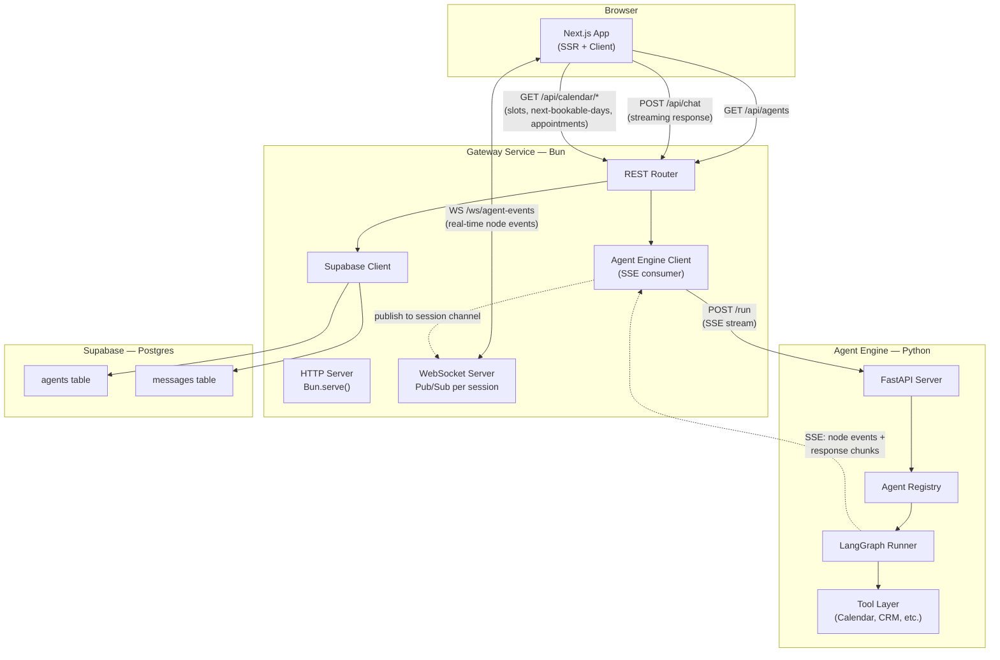
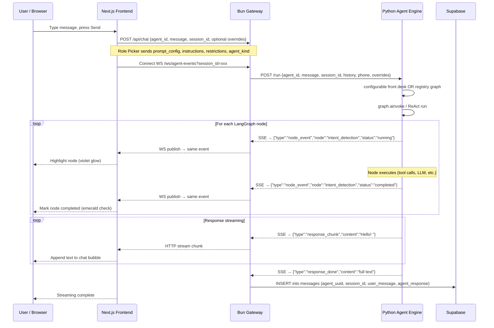
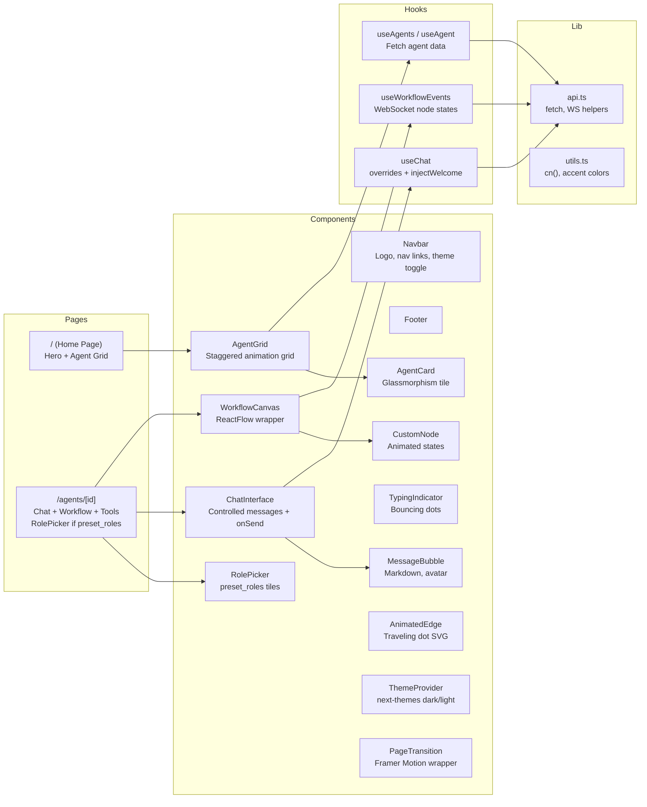
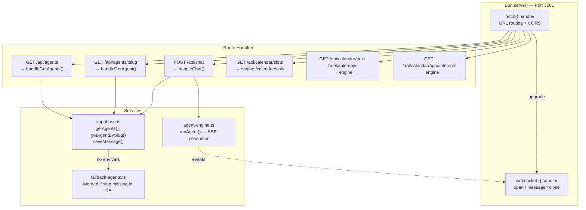
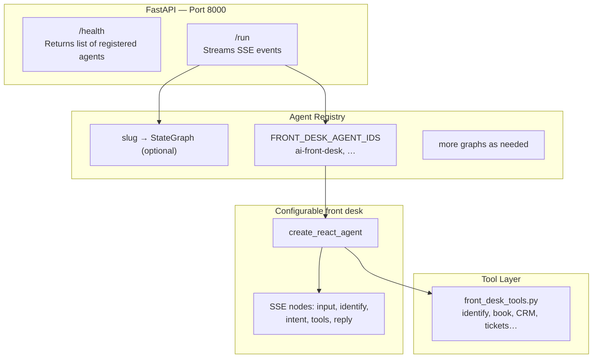
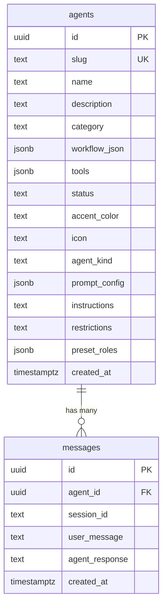

# Architecture

## High-Level System Overview



---

## Request Lifecycle — Chat Flow

This is the complete journey of a single user message from keypress to rendered response.



---

## Service-by-Service Breakdown

### 1. Frontend — Next.js App Router



**Role of each piece:**

| File | Purpose |
|------|---------|
| `app/layout.tsx` | Root layout. Wraps everything in `ThemeProvider` (dark default), renders `Navbar` + `Footer`, loads Inter font. The `bg-zinc-950` on `<body>` prevents white flash on route changes. |
| `app/page.tsx` | Home page. Animated gradient hero section, scroll-down indicator, and `AgentGrid` that fetches agents from the gateway. |
| `app/agents/[id]/page.tsx` | Agent detail. Left: `ChatInterface`. Right: `WorkflowCanvas` from `workflow_json`. If `preset_roles` exists, **RolePicker** bar; role change clears chat, new session, `setOverrides` + welcome inject. Tool badges below. |
| `components/agents/role-picker.tsx` | Preset tiles (icon, label, accent). `onRoleChange` → parent resets chat and overrides. |
| `components/agents/agent-card.tsx` | Single agent tile. Glassmorphism card with accent color strip, hover lift effect, status badge with pulse dot, and "Try Demo" link. |
| `components/agents/agent-grid.tsx` | Grid wrapper. Renders cards with Framer Motion stagger animation. Shows skeleton shimmer while loading. |
| `components/chat/chat-interface.tsx` | Chat UI (props: messages, onSend, onClear, streaming). Parent owns state for role resets. |
| `components/chat/message-bubble.tsx` | Single message. User messages get violet gradient (right-aligned), assistant messages get dark bg with markdown rendering. |
| `components/chat/typing-indicator.tsx` | Three dots bouncing with staggered Framer Motion animation. |
| `components/workflow/workflow-canvas.tsx` | ReactFlow instance. Converts `workflow_json` nodes/edges into ReactFlow format, injects `nodeStates` into each node's data, determines which edges are "active". |
| `components/workflow/custom-node.tsx` | Custom ReactFlow node. Three visual states: idle (muted), running (violet pulse glow + spinner), completed (emerald + checkmark). Spring animations on state change. |
| `components/workflow/animated-edge.tsx` | Custom ReactFlow edge. Uses `getSmoothStepPath`. When active, the edge turns violet and a small circle travels along the SVG path. |
| `components/layout/navbar.tsx` | Fixed top bar with backdrop blur. Logo, nav links with animated active indicator (Framer Motion `layoutId`), and sun/moon theme toggle. |
| `components/layout/footer.tsx` | Simple footer with logo and attribution. |
| `components/layout/page-transition.tsx` | Framer Motion wrapper that fades pages up on enter and down on exit. |
| `components/theme-provider.tsx` | Thin wrapper around `next-themes` `ThemeProvider`. Configured with `defaultTheme="dark"`. |
| `hooks/use-agents.ts` | `useAgents()` fetches all agents. `useAgent(slug)` fetches one. Both include in-memory fallback data so the frontend works without the gateway. |
| `hooks/use-chat.ts` | Messages, streaming, `setOverrides` (prompt_config, instructions, restrictions, agent_kind), `injectWelcome`, `sendChatMessage` with overrides. |
| `hooks/use-workflow-events.ts` | Opens a WebSocket to `/ws/agent-events?session_id=xxx`. Parses incoming `node_event` messages and maintains a `Record<string, NodeStatus>` map. |
| `lib/api.ts` | Gateway HTTP client. `fetchAgents()`, `fetchAgent(slug)`, `sendChatMessage()`, `fetchSlotsForDate()`, `fetchNextBookableDays()`, `fetchSessionAppointments()`, `createWebSocket()`. |
| `lib/utils.ts` | `cn()` for Tailwind class merging. `ACCENT_COLORS` map and `getAccentColor()` for per-agent theming (violet, cyan, amber, emerald). |
| `types/index.ts` | `Agent`, `AgentPresetRole`, `preset_roles`, `agent_kind`, `ChatConfigOverrides`, workflow + chat types. |

---

### 2. Gateway — Bun API Server



**Role of each piece:**

| File | Purpose |
|------|---------|
| `src/index.ts` | Entry point. `Bun.serve()` with **`idleTimeout`** from **`GATEWAY_IDLE_TIMEOUT`** (default 120s) so streaming chat does not hit Bun’s 10s default. Proxies **`/api/calendar/*`** to the engine. WebSocket `/ws/agent-events`. |
| `src/routes/agents.ts` | Handles `GET /api/agents` (returns all active/beta agents) and `GET /api/agents/:slug` (returns a single agent). Delegates to the Supabase service. |
| `src/routes/chat.ts` | Handles `POST /api/chat`. Parses `{agent_id, message, session_id}`, calls `runAgent()` to start the agent, streams response chunks back to the client as a `ReadableStream`, and publishes node events to the WebSocket channel. After completion, saves the message to Supabase. |
| `src/services/supabase.ts` | Supabase client; if unset, full fallback list. **`getAgents()`** merges `FALLBACK_AGENTS` rows whose slugs are missing from DB (so `ai-front-desk` always appears when DB is stale). `saveMessage()` resolves slug → UUID for `messages.agent_id`. |
| `src/services/agent-engine.ts` | HTTP client for the Python service. Sends `POST /run` and reads the SSE response line by line. For each `data:` line, parses the JSON event and calls `onEvent()` (which publishes to WebSocket). Returns the accumulated full response text. |
| `src/services/fallback-agents.ts` | Static array of 4 demo agents matching the DB seed schema. Used when Supabase is not configured so the platform works out-of-the-box. |
| `src/types.ts` | `ChatRequest`: agent_id, message, session_id, phone, history, agent_kind, prompt_config, instructions, restrictions. |

---

### 3. Agent Engine — Python / LangGraph



**Role of each piece:**

| File | Purpose |
|------|---------|
| `app/main.py` | FastAPI. `/run` routes **configurable front desk** slugs + `agent_kind === configurable_front_desk` to `run_configurable_front_desk()`; optional classic graphs from registry. SSE: node events + response chunks. |
| `app/config.py` | Loads environment variables (`OPENAI_API_KEY`, `SUPABASE_URL`, `HOST`, `PORT`) from `.env` using `python-dotenv`. |
| `app/agents/base.py` | Defines `AgentState` — a `TypedDict` used as the LangGraph state schema. Fields: `messages`, `current_input`, `intent`, `tool_results`, `response`. Also defines the `EventCallback` type alias for the async event emission function. |
| `app/agents/registry.py` | `FRONT_DESK_AGENT_IDS`; classic slug → graph map (extensible). `list_available_agents()` includes front-desk slugs. |
| `app/graphs/front_desk_graph.py` | ReAct agent, composed system prompt from request/DB, emits workflow SSE aligned with UI nodes. |
| `app/graphs/front_desk_tools.py` | LangChain `@tool` mocks; `set_front_desk_context` for session/phone. |
| `app/prompts/prompt_builder.py` | Merges base prompt + config + instructions + restrictions. |
| `app/llm.py` | Shared `ChatOpenAI` (gpt-4o-mini). |

---

### 4. Database — Supabase (Postgres)



| Table | Purpose |
|-------|---------|
| `agents` | Master list. `workflow_json` / `tools` drive UI. **`preset_roles`** powers the Role Picker. **`agent_kind`** + **`prompt_config`** / **`instructions`** / **`restrictions`** drive the configurable front-desk engine. `status`: `active` \| `beta` \| `inactive`. |
| `messages` | Chat history. Every completed exchange is saved as a row with both user and agent text, linked by `agent_id` (UUID FK) and grouped by `session_id`. |

---

## Event Protocol

All events between services use this JSON schema:

```
┌──────────────────────────────────────────────────────────────────┐
│ Python → Gateway (SSE)  │  Gateway → Frontend (WebSocket)       │
│                         │                                        │
│  data: {"type":"node_event","node":"intent_detection",           │
│         "status":"running"}                                      │
│                                                                  │
│  data: {"type":"node_event","node":"intent_detection",           │
│         "status":"completed"}                                    │
│                                                                  │
│  data: {"type":"response_chunk","content":"Hello! "}             │
│                                                                  │
│  data: {"type":"response_done","content":"full response text"}   │
│                                                                  │
│  data: [DONE]                                                    │
└──────────────────────────────────────────────────────────────────┘
```

| Event Type | Direction | Purpose |
|------------|-----------|---------|
| `node_event` + `running` | Python → Gateway → Frontend | Triggers violet glow animation on the ReactFlow node |
| `node_event` + `completed` | Python → Gateway → Frontend | Switches node to emerald completed state |
| `response_chunk` | Python → Gateway → Frontend | Appends text to the chat bubble (streaming effect) |
| `response_done` | Python → Gateway | Signals end of response; gateway saves to DB |
| `[DONE]` | Python → Gateway | SSE stream terminator |

---

## Technology Choices and Rationale

| Technology | Layer | Why |
|------------|-------|-----|
| **Next.js 15 (App Router)** | Frontend | Server components for SEO, client components for interactivity, file-based routing for agent pages |
| **TailwindCSS** | Frontend | Utility-first CSS, zero runtime, dark mode via `class` strategy |
| **shadcn/ui** | Frontend | Accessible, unstyled primitives built on Radix — full control over design tokens |
| **React Flow (@xyflow/react)** | Frontend | Purpose-built for node-graph UIs, custom node/edge support, built-in pan/zoom |
| **Framer Motion** | Frontend | Declarative animations, layout animations, `AnimatePresence` for mount/unmount |
| **next-themes** | Frontend | SSR-safe theme switching with zero flash, localStorage persistence |
| **Bun** | Gateway | Native WebSocket server (no `ws` or `socket.io`), 7x throughput vs Node, TypeScript out of the box |
| **FastAPI** | Agent Engine | Async by default, `StreamingResponse` for SSE, auto-generated OpenAPI docs |
| **LangGraph** | Agent Engine | Graph-based agent orchestration, conditional routing, built-in state management, durable execution |
| **Supabase** | Database | Managed Postgres with instant REST API, auth-ready, realtime subscriptions for future use |
