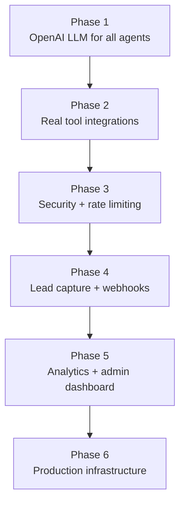
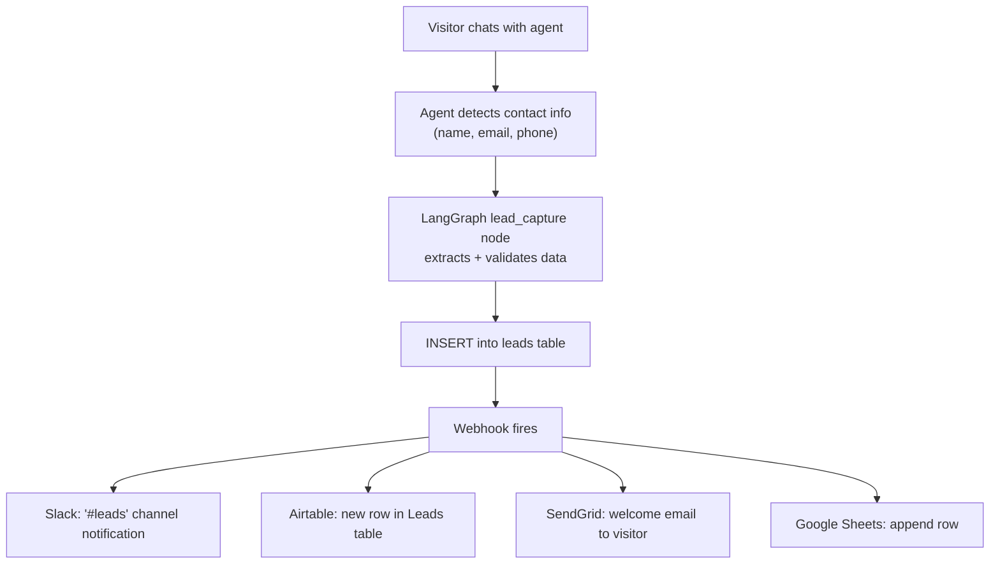
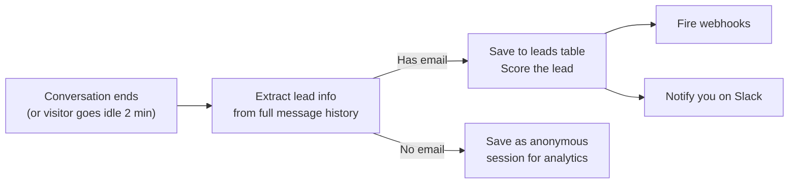
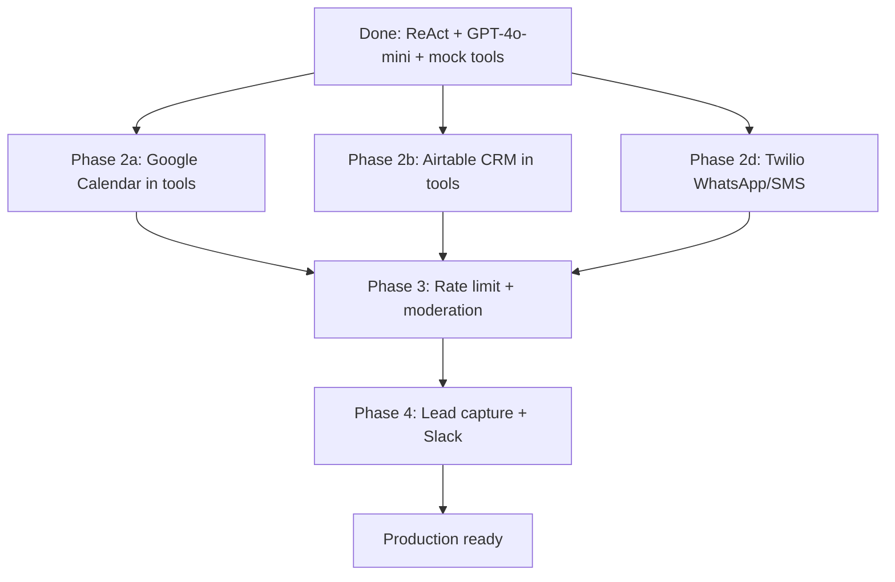
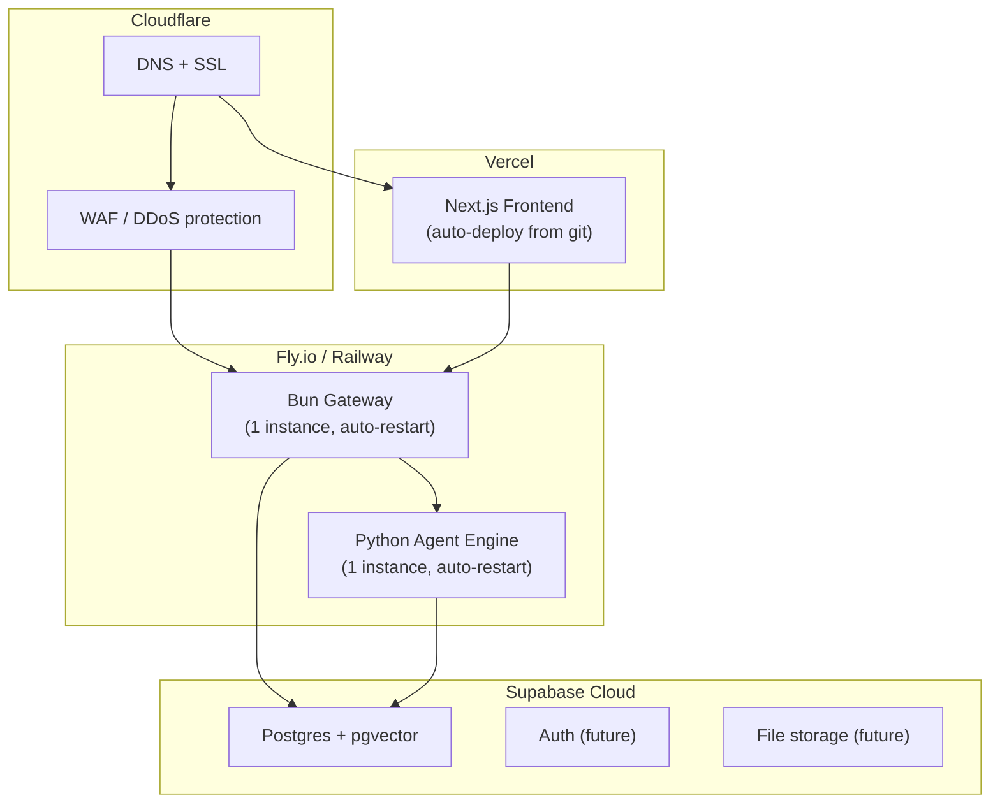

# Future Plan — Production Roadmap

> **Context**: You are the sole admin. You build and deploy agents yourself. Visitors interact with agents on the website. There is no marketplace, no outside developers, no multi-tenant access. Every agent is authored by you and published when ready.

---

## Roadmap Overview



---

## Phase 1 — Add OpenAI LLM ✅ (done)

**Delivered:** Configurable **AI Front Desk** uses **GPT-4o-mini** via LangGraph `create_react_agent` (ReAct). System prompt is built per request from `prompt_config`, `instructions`, `restrictions` (and Role Picker overrides).

| Deliverable | Location |
|-------------|----------|
| Shared LLM | `agent-engine/app/llm.py` |
| Front-desk graph + streaming | `agent-engine/app/graphs/front_desk_graph.py` |
| Tools (mock) | `agent-engine/app/graphs/front_desk_tools.py` |
| Prompt assembly | `agent-engine/app/prompts/prompt_builder.py` + `configurable_front_desk_base.txt` |
| Docs | [phase1-openai.md](./phase1-openai.md) |

**Optional later:** Any *new* classic `StateGraph` agents can use the same `llm.py` pattern for node-level LLM calls.

---

## Phase 2 — Real Tool Integrations

### 2a. Google Calendar (AI Front Desk / booking tools)

**Replaces:** `app/tools/calendar.py` mock

| Item | Detail |
|------|--------|
| **API** | Google Calendar API v3 |
| **Auth** | OAuth 2.0 service account or user consent flow |
| **Python SDK** | `google-api-python-client`, `google-auth` |
| **Functions** | `check_availability(date_range)` — real freebusy query, `create_event(title, time, attendees)` — creates calendar event |

```python
# app/tools/calendar.py (future)
from google.oauth2.credentials import Credentials
from googleapiclient.discovery import build

def get_calendar_service(credentials_json: str):
    creds = Credentials.from_authorized_user_info(json.loads(credentials_json))
    return build("calendar", "v3", credentials=creds)

async def check_availability(date_start: str, date_end: str) -> dict:
    service = get_calendar_service(os.getenv("GOOGLE_CALENDAR_CREDS"))
    body = {
        "timeMin": date_start,
        "timeMax": date_end,
        "items": [{"id": "primary"}],
    }
    result = service.freebusy().query(body=body).execute()
    busy = result["calendars"]["primary"]["busy"]
    return {"slots": compute_free_slots(busy, date_start, date_end)}

async def create_event(title: str, start: str, end: str, attendees: list[str]) -> dict:
    service = get_calendar_service(os.getenv("GOOGLE_CALENDAR_CREDS"))
    event = {
        "summary": title,
        "start": {"dateTime": start},
        "end": {"dateTime": end},
        "attendees": [{"email": e} for e in attendees],
    }
    created = service.events().insert(calendarId="primary", body=event).execute()
    return {"event_id": created["id"], "link": created.get("htmlLink")}
```

### 2b. Airtable (CRM — leads + front-desk `update_crm_record`)

**Replaces / extends:** mock CRM paths in `front_desk_tools` + any legacy CRM mocks

| Item | Detail |
|------|--------|
| **API** | Airtable REST API |
| **Auth** | Personal Access Token |
| **Python SDK** | `pyairtable` |
| **Functions** | `search_contacts(query)`, `create_lead(data)`, `update_lead_score(id, score)` |

```python
# app/tools/crm.py (future)
from pyairtable import Api

def get_airtable():
    return Api(os.getenv("AIRTABLE_API_KEY"))

async def search_contacts(query: str) -> dict:
    table = get_airtable().table(os.getenv("AIRTABLE_BASE_ID"), "Contacts")
    formula = f"OR(FIND(LOWER('{query}'), LOWER({{Name}})), FIND(LOWER('{query}'), LOWER({{Company}})))"
    records = table.all(formula=formula)
    return {"results": [r["fields"] for r in records]}

async def create_lead(name: str, email: str, company: str, score: int) -> dict:
    table = get_airtable().table(os.getenv("AIRTABLE_BASE_ID"), "Leads")
    record = table.create({"Name": name, "Email": email, "Company": company, "Score": score})
    return {"id": record["id"]}
```

### 2c. Google Sheets (Alternative to Airtable)

| Item | Detail |
|------|--------|
| **API** | Google Sheets API v4 |
| **Auth** | Service account |
| **Python SDK** | `gspread` |
| **Use case** | Read/write contact lists, log interactions, simple CRM |

```python
# app/tools/sheets.py (future)
import gspread
from google.oauth2.service_account import Credentials

def get_sheet(sheet_name: str):
    creds = Credentials.from_service_account_file("service-account.json",
        scopes=["https://www.googleapis.com/auth/spreadsheets"])
    gc = gspread.authorize(creds)
    return gc.open(sheet_name)

async def append_row(sheet_name: str, data: list) -> None:
    sheet = get_sheet(sheet_name).sheet1
    sheet.append_row(data)
```

### 2d. Twilio (SMS/WhatsApp — confirmations & handoff)

| Item | Detail |
|------|--------|
| **API** | Twilio SMS / WhatsApp / Voice |
| **Auth** | Account SID + Auth Token |
| **Python SDK** | `twilio` |
| **Functions** | `send_sms(to, body)`, `send_whatsapp(to, body)`, `initiate_call(to)` |

```python
# app/tools/twilio_tool.py (future)
from twilio.rest import Client

def get_twilio():
    return Client(os.getenv("TWILIO_ACCOUNT_SID"), os.getenv("TWILIO_AUTH_TOKEN"))

async def send_sms(to: str, body: str) -> dict:
    client = get_twilio()
    msg = client.messages.create(
        body=body,
        from_=os.getenv("TWILIO_PHONE_NUMBER"),
        to=to,
    )
    return {"sid": msg.sid, "status": msg.status}

async def send_whatsapp(to: str, body: str) -> dict:
    client = get_twilio()
    msg = client.messages.create(
        body=body,
        from_=f"whatsapp:{os.getenv('TWILIO_WHATSAPP_NUMBER')}",
        to=f"whatsapp:{to}",
    )
    return {"sid": msg.sid, "status": msg.status}
```

### 2e. Web Search (Research Agent)

| Item | Detail |
|------|--------|
| **API** | Tavily Search API (or Serper / SerpAPI) |
| **Auth** | API key |
| **Python SDK** | `tavily-python` or `langchain-community` built-in |

```python
# app/tools/search.py (future)
from tavily import TavilyClient

async def web_search(query: str, max_results: int = 5) -> dict:
    client = TavilyClient(api_key=os.getenv("TAVILY_API_KEY"))
    results = client.search(query, max_results=max_results)
    return {
        "results": [
            {"title": r["title"], "url": r["url"], "snippet": r["content"][:300]}
            for r in results["results"]
        ]
    }
```

### 2f. Email — SendGrid (All Agents)

| Item | Detail |
|------|--------|
| **API** | SendGrid v3 |
| **Auth** | API key |
| **Python SDK** | `sendgrid` |
| **Functions** | `send_email(to, subject, body_html)` |

### 2g. Slack (Internal Notifications to You)

| Item | Detail |
|------|--------|
| **API** | Slack Web API |
| **Auth** | Bot token |
| **Python SDK** | `slack_sdk` |
| **Functions** | `notify_admin(channel, message)` — sends you a Slack message when a lead is captured, a meeting is booked, or an issue needs attention |

---

## Phase 3 — Security, Abuse Prevention, and Usage Limits

This is critical before going live. Visitors will be anonymous users chatting with your agents — you need to control cost, prevent abuse, and protect your API keys.

### 3a. Rate Limiting

**Where:** Bun gateway (`src/index.ts`)

```
Visitor → Gateway rate limiter → Agent Engine → OpenAI
```

| Rule | Implementation |
|------|---------------|
| **Per-IP message limit** | Max 20 messages per 15 minutes per IP. Store counts in a `Map<string, {count, resetAt}>` in gateway memory. Return HTTP 429 when exceeded. |
| **Per-session limit** | Max 50 messages per session. Prevents a single conversation from running forever. |
| **Global concurrent limit** | Max 10 simultaneous agent runs. Queue additional requests. Prevents your OpenAI bill from spiking. |

```typescript
// gateway/src/middleware/rate-limiter.ts (future)
const ipCounts = new Map<string, { count: number; resetAt: number }>();
const WINDOW_MS = 15 * 60 * 1000;
const MAX_PER_WINDOW = 20;

export function checkRateLimit(ip: string): boolean {
  const now = Date.now();
  const entry = ipCounts.get(ip);
  if (!entry || now > entry.resetAt) {
    ipCounts.set(ip, { count: 1, resetAt: now + WINDOW_MS });
    return true;
  }
  if (entry.count >= MAX_PER_WINDOW) return false;
  entry.count++;
  return true;
}
```

### 3b. Input Sanitization

**Where:** Gateway chat route + Agent Engine

| Threat | Protection |
|--------|-----------|
| **Prompt injection** | System prompt instructs the LLM to stay in role. Add a guardrail node in LangGraph that checks user input before it reaches the LLM. Reject messages containing jailbreak patterns. |
| **XSS in messages** | Frontend already uses React (auto-escapes). Markdown renderer should use `react-markdown` with no `dangerouslySetInnerHTML`. Already in place. |
| **SQL injection** | Supabase client uses parameterized queries. Already safe. |
| **Oversized payloads** | Reject message bodies over 2,000 characters in the gateway. |

```typescript
// In gateway/src/routes/chat.ts — add at the top of handleChat
if (message.length > 2000) {
  return Response.json({ error: "Message too long (max 2000 chars)" }, { status: 400 });
}
```

### 3c. Content Moderation

**Where:** Agent engine, before LLM call

| Approach | Detail |
|----------|--------|
| **OpenAI Moderation API** | Free. Send user input to `POST https://api.openai.com/v1/moderations` before passing to the agent. Block if flagged. |
| **LangGraph guardrail node** | Add an `input_guard` node at the start of every graph that calls the moderation API. If flagged, short-circuit to a polite refusal response. |

```python
# app/tools/moderation.py (future)
import openai

async def check_content(text: str) -> bool:
    """Returns True if content is safe, False if flagged."""
    client = openai.AsyncOpenAI()
    response = await client.moderations.create(input=text)
    return not response.results[0].flagged
```

### 3d. API Key Protection

| Concern | Solution |
|---------|----------|
| **OpenAI key exposed?** | Never sent to frontend. Only used in the Python agent engine on the server. |
| **Supabase anon key** | Used in the gateway only. RLS policies restrict what anon can do (read agents, insert messages). |
| **Third-party keys (Twilio, Airtable, etc.)** | Stored in agent engine `.env` only. Never touch the gateway or frontend. |
| **Secrets in git** | `.gitignore` blocks `.env`, `secrets.txt`. Double-check with `git status` before pushing. |

### 3e. CORS Lockdown (Production)

Currently CORS is `*` (allow all). For production:

```typescript
// gateway/src/index.ts — change corsHeaders
const corsHeaders = {
  "Access-Control-Allow-Origin": process.env.FRONTEND_URL || "https://yourdomain.com",
  "Access-Control-Allow-Methods": "GET, POST, OPTIONS",
  "Access-Control-Allow-Headers": "Content-Type",
};
```

### 3f. OpenAI Cost Controls

| Control | How |
|---------|-----|
| **Model choice** | Use `gpt-4o-mini` (cheap) for simple agents, `gpt-4o` only for complex research. Set per-agent in config. |
| **Max tokens per response** | Set `max_tokens=500` on the LLM call. Prevents runaway responses. |
| **Monthly budget alert** | Set a billing limit in OpenAI dashboard. Get email alerts at 80% usage. |
| **Token logging** | Log token usage per agent per day in Supabase. Query to spot anomalies. |

### 3g. Supabase RLS (Row-Level Security)

Lock down database access so the anon key can only do what is intended:

```sql
-- Visitors can read agents but not modify them
alter table agents enable row level security;
create policy "Public read agents" on agents for select to anon using (true);

-- Visitors can insert messages (chat history) but not read/delete others
alter table messages enable row level security;
create policy "Anon insert messages" on messages for insert to anon with check (true);

-- Only you (via service_role key or Supabase dashboard) can update/delete anything
```

---

## Phase 4 — Lead Capture, Webhooks, and Conversion Hooks

This is what turns your agents from demos into business tools. Every agent interaction is a potential lead.

### 4a. Lead Capture Table

```sql
-- supabase/schema.sql addition
CREATE TABLE leads (
  id          UUID PRIMARY KEY DEFAULT uuid_generate_v4(),
  agent_slug  TEXT NOT NULL,
  session_id  TEXT NOT NULL,
  name        TEXT,
  email       TEXT,
  phone       TEXT,
  company     TEXT,
  interest    TEXT,
  score       INTEGER DEFAULT 0,
  source      TEXT DEFAULT 'chat',
  raw_messages JSONB,
  captured_at TIMESTAMPTZ NOT NULL DEFAULT NOW()
);

CREATE INDEX idx_leads_email ON leads(email);
CREATE INDEX idx_leads_captured ON leads(captured_at DESC);
```

### 4b. How Lead Capture Works



### Implementation

Add a `lead_capture` node to any agent graph:

```python
# app/tools/lead_capture.py (future)
import json
from langchain_openai import ChatOpenAI

llm = ChatOpenAI(model="gpt-4o-mini", temperature=0)

async def extract_lead_info(conversation: list[dict]) -> dict | None:
    """Use LLM to extract structured lead data from conversation."""
    response = await llm.ainvoke([
        {"role": "system", "content": """Extract contact information from this conversation.
Return JSON: {"name": "...", "email": "...", "phone": "...", "company": "...", "interest": "..."}
If no contact info found, return null."""},
        {"role": "user", "content": json.dumps(conversation)},
    ])
    try:
        data = json.loads(response.content)
        if data and data.get("email"):
            return data
    except json.JSONDecodeError:
        pass
    return None
```

### 4c. Webhook System

When a lead is captured, fire webhooks to external services. Configure per-agent which webhooks to trigger.

```sql
-- Add to agents table
ALTER TABLE agents ADD COLUMN webhooks JSONB DEFAULT '[]';

-- Example webhook config:
-- [
--   {"type": "slack", "channel": "#leads"},
--   {"type": "airtable", "table": "Leads"},
--   {"type": "email", "template": "welcome_lead"},
--   {"type": "google_sheets", "sheet": "Lead Tracker"}
-- ]
```

```python
# app/tools/webhooks.py (future)
async def fire_webhooks(agent_slug: str, lead_data: dict, webhooks: list[dict]):
    for hook in webhooks:
        if hook["type"] == "slack":
            await notify_slack(hook["channel"], format_lead_message(lead_data))
        elif hook["type"] == "airtable":
            await create_airtable_row(hook["table"], lead_data)
        elif hook["type"] == "email":
            await send_welcome_email(lead_data["email"], hook["template"])
        elif hook["type"] == "google_sheets":
            await append_sheet_row(hook["sheet"], lead_data)
```

### 4d. Conversation-to-Lead Pipeline

Every agent can optionally run a post-conversation analysis:



### 4e. Lead Scoring

Score leads based on conversation quality:

| Signal | Points |
|--------|--------|
| Provided email | +30 |
| Provided phone | +20 |
| Provided company name | +15 |
| Asked about pricing | +25 |
| Booked a meeting | +40 |
| Multiple messages (>5) | +10 |
| Mentioned competitor | +10 |
| Negative sentiment | -20 |

Scores stored in `leads.score`. Use them to prioritize follow-up.

---

## Phase 5 — Analytics and Admin Dashboard

You need visibility into how visitors use your agents. This is an admin-only page, not public.

### 5a. Admin Route

Add `/admin` to the frontend (protected by a simple password or Supabase auth):

| View | Data |
|------|------|
| **Agent overview** | Messages per agent (daily/weekly), active sessions |
| **Lead pipeline** | Leads captured, scores, conversion funnel |
| **Conversation browser** | Read full chat history for any session |
| **Cost tracker** | OpenAI tokens used per agent per day |
| **Error log** | Failed agent runs, tool errors |

### 5b. Analytics Tables

```sql
CREATE TABLE analytics_events (
  id          UUID PRIMARY KEY DEFAULT uuid_generate_v4(),
  event_type  TEXT NOT NULL,
  agent_slug  TEXT NOT NULL,
  session_id  TEXT,
  metadata    JSONB DEFAULT '{}',
  created_at  TIMESTAMPTZ NOT NULL DEFAULT NOW()
);

-- Event types: 'chat_start', 'chat_message', 'chat_end',
-- 'lead_captured', 'meeting_booked', 'tool_error', 'rate_limited'
```

### 5c. Useful Queries

```sql
-- Messages per agent today
SELECT a.name, COUNT(*) as msg_count
FROM messages m JOIN agents a ON m.agent_id = a.id
WHERE m.created_at > CURRENT_DATE
GROUP BY a.name ORDER BY msg_count DESC;

-- Leads this week
SELECT agent_slug, COUNT(*), AVG(score) as avg_score
FROM leads WHERE captured_at > NOW() - INTERVAL '7 days'
GROUP BY agent_slug;

-- Busiest hours
SELECT EXTRACT(HOUR FROM created_at) as hour, COUNT(*)
FROM messages WHERE created_at > NOW() - INTERVAL '30 days'
GROUP BY hour ORDER BY hour;
```

---

## Phase 6 — Per-Agent Production Roadmap

### AI Front Desk (configurable)



| Phase | What changes | Env vars needed |
|-------|-------------|-----------------|
| 1 | ✅ LLM + tool calling (same for all `preset_roles`) | `OPENAI_API_KEY` |
| 2a | Real `check_availability` / `book_appointment` | `GOOGLE_CALENDAR_CREDS` |
| 2b | Real CRM from Airtable | `AIRTABLE_API_KEY`, `AIRTABLE_BASE_ID` |
| 2d | Outbound SMS/WhatsApp | `TWILIO_*` |
| 3 | Rate limit + moderation | — |
| 4 | Leads + Slack when booked | `SLACK_BOT_TOKEN` |

### Customer Support Agent

| Phase | What changes | Env vars needed |
|-------|-------------|-----------------|
| 1 | LLM for issue classification + response | `OPENAI_API_KEY` |
| 2 | Knowledge base search (Supabase pgvector + embeddings) | `OPENAI_API_KEY` (for embeddings) |
| 3 | Order tracking via Airtable or Shopify API | `AIRTABLE_API_KEY` or `SHOPIFY_API_KEY` |
| 4 | Ticket creation in Linear/Jira | `LINEAR_API_KEY` or `JIRA_API_TOKEN` |
| 5 | Email/Slack escalation to you | `SENDGRID_API_KEY`, `SLACK_BOT_TOKEN` |
| 6 | Lead capture from support conversations | None (reuse lead_capture tool) |

### Lead Qualification Agent

| Phase | What changes | Env vars needed |
|-------|-------------|-----------------|
| 1 | LLM for conversational scoring | `OPENAI_API_KEY` |
| 2 | CRM integration (Airtable) | `AIRTABLE_API_KEY` |
| 3 | Lead enrichment (Clearbit/Apollo) | `CLEARBIT_API_KEY` |
| 4 | Slack notification when hot lead detected | `SLACK_BOT_TOKEN` |
| 5 | Auto email follow-up sequences | `SENDGRID_API_KEY` |
| 6 | Google Sheets export for weekly review | `GOOGLE_SHEETS_CREDS_FILE` |

### Research Agent

| Phase | What changes | Env vars needed |
|-------|-------------|-----------------|
| 1 | LLM for query planning + synthesis | `OPENAI_API_KEY` |
| 2 | Web search (Tavily) | `TAVILY_API_KEY` |
| 3 | Document ingestion (PDF/URL parsing) | `OPENAI_API_KEY` (for embeddings) |
| 4 | Supabase pgvector store for document search | `SUPABASE_URL` |
| 5 | Export reports to Google Docs or email | `GOOGLE_DOCS_CREDS` or `SENDGRID_API_KEY` |

---

## Phase 7 — Production Infrastructure

| Concern | Current | Future |
|---------|---------|--------|
| **Frontend hosting** | `npm run dev` | Vercel (auto-deploys from git, free tier works) |
| **Gateway hosting** | `bun run dev` | Fly.io or Railway ($5/mo, auto-restart, logs) |
| **Agent engine hosting** | `python -m app.main` | Fly.io or Railway (separate service, scale independently) |
| **Domain + SSL** | localhost | Custom domain + Cloudflare (free SSL) |
| **Secrets management** | `.env` files | Fly.io secrets / Railway env vars (encrypted at rest) |
| **Monitoring** | Console logs | Sentry (errors), LangSmith (agent tracing), UptimeRobot (uptime) |
| **Backups** | None | Supabase automatic daily backups (included in free plan) |
| **CI/CD** | Manual | GitHub Actions: test on PR, deploy on push to main |
| **Log aggregation** | Terminal | Fly.io logs or Logtail ($0 for 1GB/day) |

### Deployment Architecture



---

## Environment Variables — Complete Future Reference

```env
# LLM
OPENAI_API_KEY=sk-...

# Database
SUPABASE_URL=https://xxx.supabase.co
SUPABASE_ANON_KEY=eyJ...
SUPABASE_SERVICE_ROLE_KEY=eyJ...  # admin only, never in frontend/gateway

# Google Calendar
GOOGLE_CALENDAR_CREDS={"type":"service_account",...}

# Airtable
AIRTABLE_API_KEY=pat...
AIRTABLE_BASE_ID=app...

# Google Sheets
GOOGLE_SHEETS_CREDS_FILE=service-account.json

# Twilio
TWILIO_ACCOUNT_SID=AC...
TWILIO_AUTH_TOKEN=...
TWILIO_PHONE_NUMBER=+1...
TWILIO_WHATSAPP_NUMBER=+1...

# Web Search
TAVILY_API_KEY=tvly-...

# Email
SENDGRID_API_KEY=SG...

# Slack (your workspace)
SLACK_BOT_TOKEN=xoxb-...

# Monitoring
LANGSMITH_API_KEY=ls-...
SENTRY_DSN=https://...

# Security
FRONTEND_URL=https://yourdomain.com
ADMIN_PASSWORD=...  # simple admin page protection until Supabase Auth is added
```

---

## New Agent Ideas (Future)

| Agent | Purpose | Key Tools |
|-------|---------|-----------|
| **Onboarding Agent** | Walk new clients through your services, collect requirements | Airtable, SendGrid, Google Calendar |
| **FAQ Agent** | Answer common questions from a knowledge base you maintain | Supabase pgvector, OpenAI embeddings |
| **Appointment Agent** | Single-purpose booking agent for a specific service | Google Calendar, Twilio SMS confirmation |
| **Feedback Agent** | Collect post-service feedback, log to Google Sheets | Google Sheets, sentiment analysis |
| **Invoice Agent** | Help clients check invoice status, send payment reminders | Stripe API, SendGrid |
| **Social Media Agent** | Draft social media posts from a content brief | OpenAI, Buffer API |

Each one follows the same pattern: create graph, register, insert DB row, deploy. No frontend or gateway changes.

---

## Summary

```
Phase 1: Make agents smart       → OpenAI
Phase 2: Make agents useful      → Real tools (Calendar, CRM, SMS, etc.)
Phase 3: Make agents safe        → Rate limits, moderation, CORS, RLS
Phase 4: Make agents profitable  → Lead capture, webhooks, scoring
Phase 5: Make agents measurable  → Analytics, admin dashboard
Phase 6: Per-agent production    → One agent at a time, real APIs
Phase 7: Make it production      → Hosting, CI/CD, monitoring, backups
```

Every phase is independent. You can ship Phase 1 in a day, Phase 3 in another day, and tackle the rest incrementally. The architecture supports all of it without structural changes.
