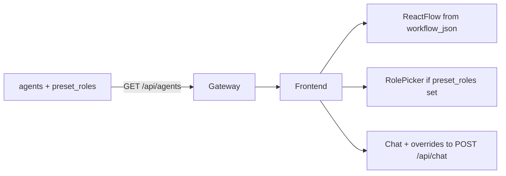

# Plug-and-Play Agent Guide

## How scalability works

The platform stays **config-driven**:

1. **Database** — `agents` rows: `workflow_json`, `tools`, optional `agent_kind`, `preset_roles`, prompts.
2. **Agent engine** — Either a **registered LangGraph** per slug, or a **shared configurable front-desk** graph for all slugs in `FRONT_DESK_AGENT_IDS`.

The frontend renders workflows from `workflow_json` and lists agents from **`GET /api/agents`**. No hardcoded agent list in the UI.

```
┌─────────────────────────────────────────────────────────────────┐
│  ADDING A “CLASSIC” AGENT (unique graph)                         │
│  1. LangGraph in agent-engine/app/graphs/                       │
│  2. Register slug → graph in registry.py                        │
│  3. INSERT agents row                                           │
└─────────────────────────────────────────────────────────────────┘

┌─────────────────────────────────────────────────────────────────┐
│  ADDING A FRONT-DESK PRESET (same graph)                        │
│  1. Append to ai-front-desk.preset_roles in DB                  │
│  2. Or add agent_kind + prompts on a new row + FRONT_DESK slug  │
│  No new Python graph required                                   │
└─────────────────────────────────────────────────────────────────┘
```

---

## Path A — New classic agent (custom graph)

### 1. Create a LangGraph

Example: `agent-engine/app/graphs/my_new_agent_graph.py` — `StateGraph(AgentState)`, nodes emit `event_callback` for workflow UI.

### 2. Register

Edit `agent-engine/app/agents/registry.py`:

```python
from app.graphs.my_new_agent_graph import build_my_new_agent_graph

def _init_registry():
    global _registry
    if not _registry:
        _registry = {
            "my-new-agent": build_my_new_agent_graph(),
        }
```

### 3. Insert DB row

```sql
INSERT INTO agents (slug, name, description, category, accent_color, icon, status, tools, workflow_json)
VALUES (
  'my-new-agent',
  'My New Agent',
  'Short description.',
  'Category',
  'cyan',
  'bot',
  'active',
  '["tool_a", "tool_b"]',
  '{"nodes":[...],"edges":[...]}'
);
```

### 4. Restart agent engine

Gateway and frontend need no code changes if the slug is active in the DB.

---

## Path B — Configurable front desk (recommended for reception-style demos)

- **Single homepage card**: `ai-front-desk`.
- **Role Picker**: driven by `preset_roles` JSONB on that row.
- **Engine**: all slugs in `FRONT_DESK_AGENT_IDS` share [`front_desk_graph.py`](../agent-engine/app/graphs/front_desk_graph.py).

To add a **new business persona**: extend `preset_roles` (see [CONFIGURABLE_AGENTS.md](./CONFIGURABLE_AGENTS.md)).

To add **another slug** that uses the same engine: add the slug to `FRONT_DESK_AGENT_IDS` and insert a row with `agent_kind = 'configurable_front_desk'`.

---

## Gateway + DB edge cases

- **`GET /api/agents`**: If Supabase is configured but **does not** include a fallback slug (e.g. `ai-front-desk`), the gateway **appends** missing entries from `fallback-agents.ts` so local/stale DBs still show AI Front Desk.
- **`POST /api/chat`** body may include: `phone`, `history`, `agent_kind`, `prompt_config`, `instructions`, `restrictions` — used for Role Picker overrides and context.

---

## Why the frontend stays generic



- **Cards**: one row per agent.
- **Workflow**: node IDs in `workflow_json` must match SSE `node` names the engine emits (front-desk graph uses `input`, `identify`, `intent`, `tools`, `reply`).
- **Animations**: WebSocket `node_event` highlights by node id.

---

## Scaling 1 → 100+ agents

| Concern | Approach |
|---------|----------|
| Many similar front desks | One slug + many `preset_roles`, or many slugs → same `FRONT_DESK_AGENT_IDS` graph |
| Distinct behaviors | Separate graphs + registry entries |
| DB | Indexes on `slug`, `status`; messages on `agent_id`, `session_id` |

---

## Accent colors & icons

Same as before: `accent_color` in `violet` | `cyan` | `amber` | `emerald`; `icon` → Lucide names in `agent-card.tsx` / detail page (`headset`, `eye`, `smile-plus`, `building-2`, `bed-double`, …).
